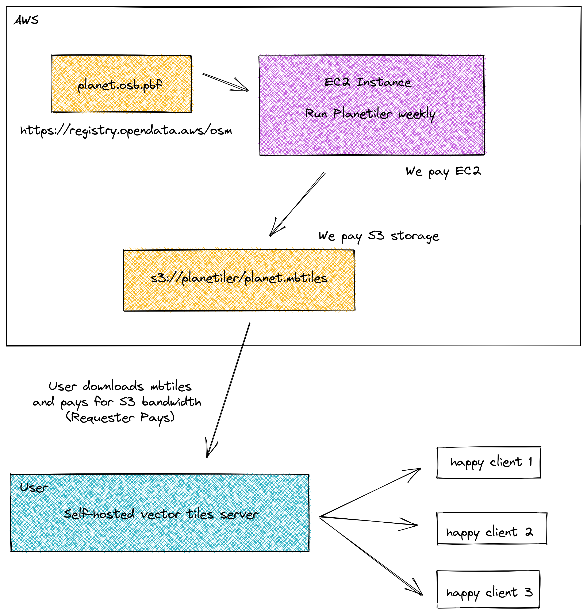

# AWS Planetiler

A service for downloading `planet.mbtiles` with ~~weekly~~ some updates.

## Overview

In the past, it was difficult to get up-to-date vector tiles from OpenStreetMap for self-hosting. While it was straightforward to download the raw `planet.osm.pbf` data e.g. from [Geofabrik](https://download.geofabrik.de/), converting the raw data to a vector tiles `planet.mbtiles` file was tedious. The processing with [OpenMapTiles](https://github.com/openmaptiles) for example took several days and involved lots of database configuration.

[Planetiler](https://github.com/onthegomap/planetiler) is a tool written by [Mike Barry](https://github.com/msbarry) which is over 100x faster than the OpenMapTiles method, while still producing an output which is compliant with the OpenMapTiles schema. On a machine with 32 cores, 128 GB ram, and 600 GB SSD, planetiler can render the full planet in something like 2 hours.

AWS Planetiler is a service which converts `planet.osm.pbf` to `planet.mbtiles` once a week and stores the output in an S3 bucket `s3://planetiler/planet.mbtiles`. You can download the up-to-date `planet.mbtiles` from this bucket and use it for self-hosting. We pay the processing cost on an EC2 instance and the storage cost on the S3 bucket. You pay the download bandwidth, an approach called [Requester Pays](https://docs.aws.amazon.com/AmazonS3/latest/userguide/RequesterPaysBuckets.html).

 

## Assets

|key|last modified | size|
|-|-|-|
|planet.mbtiles | July 4, 2022, 13:26:08 (UTC+02:00) | 74.1 GB |
|switzerland.mbtiles | July 4, 2022, 11:27:24 (UTC+02:00) | 307.2 MB |

## Download Instructions

* Get an [AWS account](https://aws.amazon.com/premiumsupport/knowledge-center/create-and-activate-aws-account/) (required for Requester Pays)
* Install the [AWS CLI](https://aws.amazon.com/cli/)
* Run `aws s3api get-object --bucket planetiler --request-payer requester --key planet.mbtiles planet.mbtiles`

This will download the full planet file. If you want to test with a smaller file first, you can download data for Switzerland only with `--key switzerland.mbtiles`.

## Run Planetiler Yourself

Running Planetiler yourself is a lot of fun. You can get some info on how I automatically start an EC2 instance from a GitHub Actions Workflow and run Planetiler in it in [WORKFLOW.md](WORKFLOW.md).
